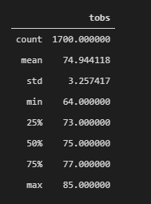
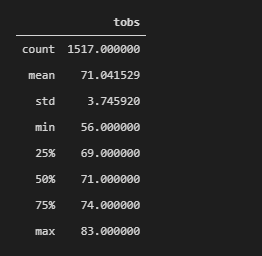

# Surf-s-Up-with-Advanced-Data-Storage-and-Retrieval
## Project Overview

Weather analysis would be conduct for the surf shop owners to identify the local weahter in Hawaii.

## Resources 

 * SQLite databased
 * SQLAlchemy 
 * Flask

## Challenge Overview

* Determine key statistical data about the month of June.
* Determine key statistical data about the month of December.
* Compare your findings between the month of June and December.
* Make 2 or 3 recommendations for further analysis.
  Share your findings in the Jupyter Notebook.

## Challenge Summary 

The average temperature is 74F (23 degree) and minimum temperature is 64F(17 degree) in June

The average temperature in December is 71F (21 degree) and minimum is 56F (13 degree).

June is the starting of the summer month and December is one of the winter months. By picking up these two months allow us to understand the  difference between summer temperature and winter temperature . However, when Hawaii is a subtropical climiate and therefore, there are no hugh difference among the temperature for the whole year. The biggest influence for travellers should be the frequency and the amount of rainfalls in Hawaii. 